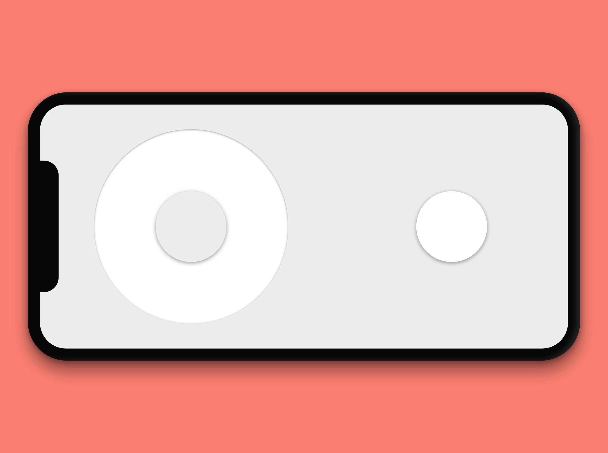

# Virtual Arcade in React

This project was bootstrapped with [Create React App](https://github.com/facebook/create-react-app).

## Deploying on Heroku

> Apps using Socket.io should enable session affinity. If you plan to use node’s Cluster module or to scale your app to multiple dynos, you should also follow Socket.io’s multiple-nodes instructions.

	heroku features:enable http-session-affinity
