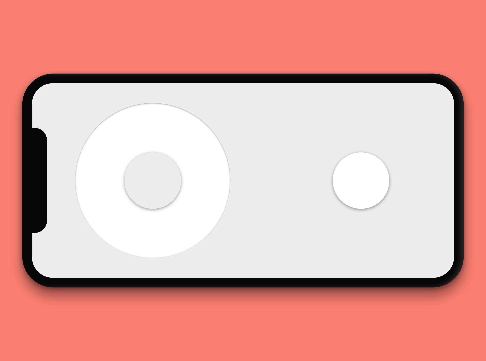

# Virtual Arcade in React

## How to run

    yarn dev

## Building a game

See [src/games/Game1/GameScreen.js](src/games/Game1/GameScreen.js)

## Deploying on Heroku

> Apps using Socket.io should enable session affinity. If you plan to use node’s Cluster module or to scale your app to multiple dynos, you should also follow Socket.io’s multiple-nodes instructions.

    heroku features:enable http-session-affinity
